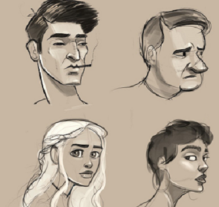
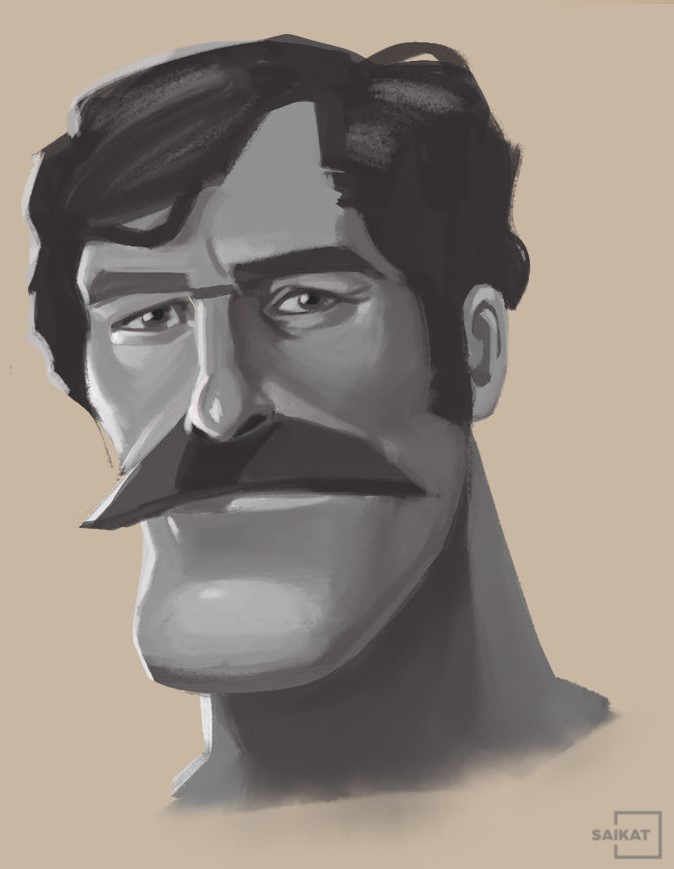
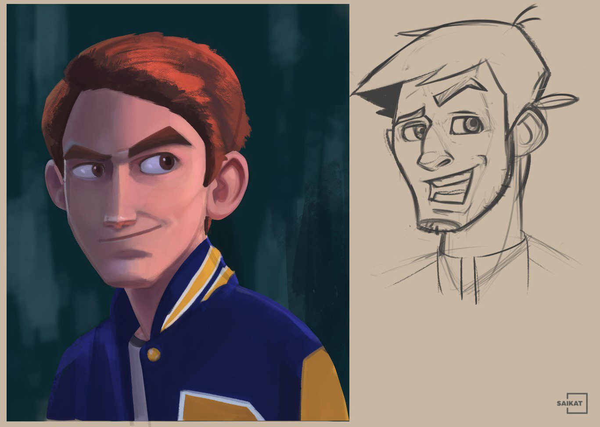
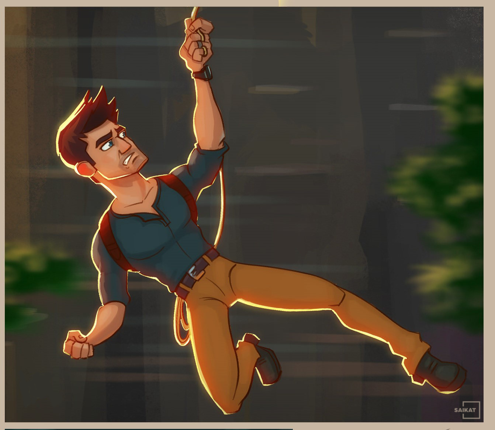
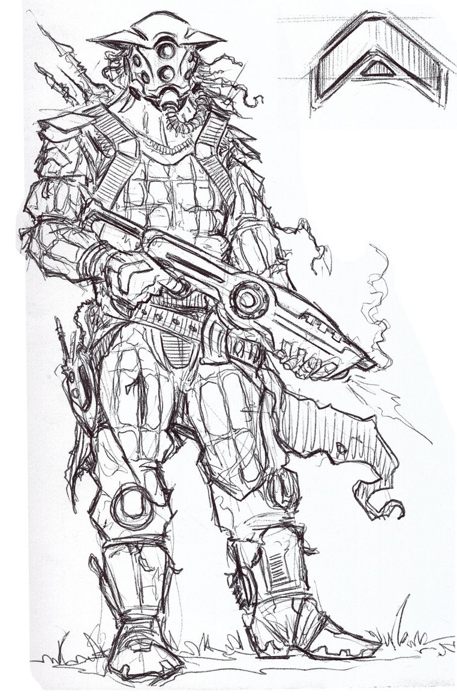
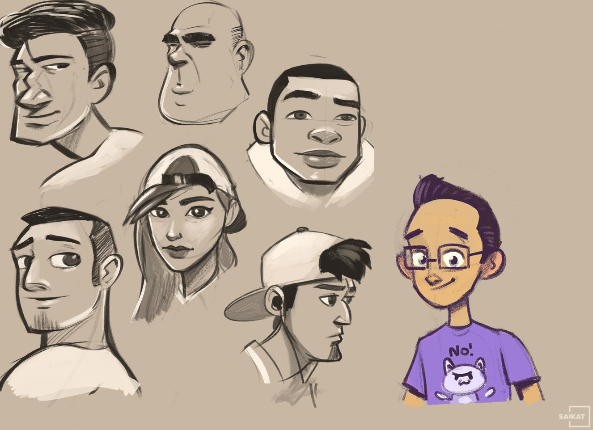

<!--<!DOCTYPE html> -->
<html lang="en">

<head>
    <meta charset="UTF-8">
    <meta name="viewport" content="width=device-width, initial-scale=1.0">
    <meta http-equiv="X-UA-Compatible" content="ie=edge">
    <title>Saikat's Portfolio</title>
<link rel = "icon" href =  
"./img/banner/logo.jpg" 
        type = "image/x-icon">

    <!--  Bootstrap css file  -->
    <link rel="stylesheet" href="./css/bootstrap.min.css">

    <!--  font awesome icons  -->
    <link rel="stylesheet" href="./css/all.min.css">

    <!--  Magnific Popup css file  -->
    <link rel="stylesheet" href="./vendor/Magnific-Popup/dist/magnific-popup.css">

    <!--  Owl-carousel css file  -->
    <link rel="stylesheet" href="./vendor/owl-carousel/css/owl.carousel.min.css">
    <link rel="stylesheet" href="./vendor/owl-carousel/css/owl.theme.default.min.css">

    <!--  custom css file  -->
    <link rel="stylesheet" href="./css/style.css">

    <!--  Responsive css file  -->
    <link rel="stylesheet" href="./css/responsive.css">

</head>

<body>

    <!--  ======================= Start Header Area ============================== -->
<a id="header">
    <header class="header_area">
        

            <nav class="navbar navbar-expand-lg navbar-light">
                
                <button class="navbar-toggler" type="button" data-toggle="collapse" data-target="#navbarNav"
                    aria-controls="navbarNav" aria-expanded="false" aria-label="Toggle navigation">
                    
                </button>
                

                    

                    <ul class="navbar-nav">
                        <li class="nav-item active">
                            <a class="nav-link" href="#header">Home (current)</a>
                        </li>
                        <li class="nav-item">
                            <a class="nav-link" href="#aboutt">about</a>
                        </li>
                        <li class="nav-item">
                            <a class="nav-link" href="#servics">services</a>
                        </li>
                        <li class="nav-item">
                            <a class="nav-link" href="#portfolios">portfolio</a>
                        </li>
                        <li class="nav-item">
                            <a class="nav-link" href="https://www.linkedin.com/in/saikat-bishal-analyst/" target="_blank">LinkedIn</a>
                        </li>
                        <li class="nav-item">
                            <a class="nav-link" href="https://codesthaan.com/blog" target="_blank">blog</a>
                        </li>
                        <li class="nav-item">
                            <a class="nav-link" href="#contct">contact</a>
                        </li>

                    </ul>
                

            </nav>
        

    </header></a>

    <!--  ======================= End Header Area ============================== -->

    <!--  ======================= Start Main Area ================================ -->
    <main class="site-main">

        <!--  ======================= Start Banner Area =======================  -->
        <section class="site-banner">
            

                

                    

                        <h3 class="title-text">Hey</h3>
                        <h1 class="title-text text-uppercase">I am Saikat</h1>
                        <h4 class="title-text text-uppercase">A Freelance Graphic Designer</h4>
                        

                            

                                <a href="My Contacts.pdf" target="_blank"><button type="button" class="btn button primary-button mr-4 text-uppercase">hire
                                    me</button></a>
                                <a href="CV.pdf" target="_blank"><button type="button" class="btn button secondary-button text-uppercase">Get cv</button></a>
                            

                        

                    

                    

                        
                    

                

            

        </section>
        <!--  ======================= End Banner Area =======================  -->

        <!--  ========================= About Area ==========================  -->
<a id="aboutt">
        <section class="about-area">
            

                

                    

                        

                            
                        

                    

                    

                        <h2 class="text-uppercase pt-5">
                            Let me
                            introduce
                            myself
                        </h2>
                        

                            

                                I am a <strong> Graphic Designer </strong>and a <strong>C++ coder</strong>. My specific task is to design and create authentic applications and illustrations. Furthermore, I am a <strong>Metallurgical and Materials Engineering</strong> student at NIT Jamshedpur.
                            

                            

                                This is my portfolio page where I showcase my work to potential recruiters in particular or anyone who is interested in my work in general. Here you'll find all of my varied skills and the projects I have done using them
                            

                        

                        <a href="CV.pdf" target="_blank"><button type="button" class="btn button primary-button text-uppercase" >Download cv</button></a>
                    

                

            

        </section>
</a>
        <!--  ========================= End About Area ==========================  -->

        <!--  ======================== Brand Area ==============================  -->

        <section class="brand-area">
            

                

                    

                        

                            

                                

                                    
                                

                            

                            

                                

                                    
                                

                            

                            

                                

                                    
                                

                            

                            

                                

                                    
                                

                            

                            

                                

                                    
                                

                            

                            

                                

                                    
                                

                            

                            

                                

                                    
                                

                            

                            

                                

                                    
                                

                            

                            

                                

                                    
                                

                            

                        

                    

                    

                        

                            

                                <h2 class="p-3 years">3</h2>
                                <h2>
                                    Years
                                    Experience
                                    Working
                                </h2>
                            

                            

                                <i class="fas fa-phone-alt fa-3x px-3"></i>
                                

                                    <a href="#" class="text-uppercase h4 font-roboto">Call Now</a>
                                    (+91)-906-421-7900
                                

                            

                            

                        

                    

                

            

        </section>

        <!--  ======================== End Brand Area ==============================  -->

        <!--  ====================== Start Services Area =============================  -->
<a id="servics">
        <section class="services-area">
            

                

                    

                        <h1 class="text-uppercase title-text">Services and Offers</h1>
                        

                            These are some of the things I do as a freelancer and  as an educator. Feel free to contact me for commission work on any of these areas. 
                        

                    

                

                

                    

                        

                            

                                

                                    
                                

                                

                                    <h5 class="card-title text-uppercase font-roboto">graphic design</h5>
                                    

                                    I have an experience of 2 years in the area of graphic design with more than 15 satisfied customers.
                                    

                                

                            

                        

                        

                            

                                

                                    
                                

                                

                                    <h5 class="card-title text-uppercase font-roboto">content management</h5>
                                    

                                        I am a professional written and visual content specialist . I am the content manager at E-Cell of NIT Jamshedpur.
                                    

                                

                            

                        

                        

                            

                                

                                    
                                

                                

                                    <h5 class="card-title text-uppercase font-roboto">digital art</h5>
                                    

                                        I am a creative and versatile digital artist. I can make traditional as well as mordern looking digital art. Follow the links below and have a look.
                                    

                                

                            

                        

                        

                            

                                

                                    
                                

                                

                                    <h5 class="card-title text-uppercase font-roboto">Backend Development</h5>
                                    

                                        I am trying my hands on some quirky backend projects. Let me know if I can do anything in this area. <strong>(Free of Cost)</strong>
                                    

                                

                            

                        

                    

                

            

        </section>
</a>
        <!--  ====================== End Services Area =============================  -->

        <!--  ======================= Project Area =============================  -->
        
        <section class="project-area">
            

                

                    <h1 class="text-uppercase title-h1">Recently Done Project</h1>
                    <h1 class="text-uppercase title-h1">Quality Work</h1>
                

                

                    <button type="button" class="active" id="btn1" data-filter="*">All</button>
                    <button type="button" data-filter=".popular">Popular</button>
                    <button type="button" data-filter=".latest">Latest</button>
                    <button type="button" data-filter=".following">Following</button>
                    <button type="button" data-filter=".upcoming">Upcoming</button>
                

                

                    

                        

                            

                                <a class="test-popup-link" href="./img/portfolio/p11.png">
                                    
                                </a>
                            

                            

                                <h4 class="text-uppercase">Face outlnes</h4>
                                Latest, Portfolio
                            

                        

                    

                    

                        

                            

                                <a class="test-popup-link" href="./img/portfolio/p21.png">
                                    
                                </a>
                            

                            

                                <h4 class="text-uppercase">uncle's face</h4>
                                Popular, Portfolio
                            

                        

                    

                    

                        

                            

                                <a class="test-popup-link" href="./img/portfolio/p31.png">
                                    
                                </a>
                            

                            

                                <h4 class="text-uppercase">character design</h4>
                                Popular, Portfolio
                            

                        

                    

                    

                        

                            

                                <a class="test-popup-link" href="./img/portfolio/p41.png">
                                    
                                </a>
                            

                            

                                <h4 class="text-uppercase">new tarzan</h4>
                                Upcoming, Portfolio
                            

                        

                    

                    

                        

                            

                                <a class="test-popup-link" href="./img/portfolio/p51.jpg">
                                    
                                </a>
                            

                            

                                <h4 class="text-uppercase">Rick Shanchez</h4>
                                Upcoming, Portfolio
                            

                        

                    

                    

                        

                            

                                <a class="test-popup-link" href="./img/portfolio/p 61.jpg">
                                    
                                </a>
                            

                            

                                <h4 class="text-uppercase">expressions</h4>
                                Following, Portfolio
                            

                        

                    

                    

                        

                            

                                <a class="test-popup-link" href="./img/portfolio/p71.png">
                                    
                                </a>
                            

                            

                                <h4 class="text-uppercase">the night sky</h4>
                                Following, Portfolio
                            

                        

                    

                    

                        

                            

                                <a class="test-popup-link" href="./img/portfolio/p81.jpg">
                                    
                                </a>
                            

                            

                                <h4 class="text-uppercase">alien invador</h4>
                                Following, Portfolio
                            

                        

                    

                    

                        

                            

                                <a class="test-popup-link" href="./img/portfolio/p91.png">
                                    
                                </a>
                            

                            

                                <h4 class="text-uppercase">face caricatures</h4>
                                Upcoming, Portfolio
                            

                        

                    

                

            

        </section>

        <!--  ======================= End Project Area =============================  -->

        <!--  ======================== About Me Area ==============================  -->

        <section class="about-area">
            

                

                    

                        

                            <h1 class="text-uppercase title-h1">Client Say about me</h1>
                            

                                These are some of the people I have worked with. Here is what they say about me and my work.
                            

                        

                    

                

            

            

                

                    

                        

                            
                        

                        

                            <h4 class="text-uppercase">Paresh Vishnu</h4>
                            
Saikat Bishal has worked under me in the E-Cell of NIT Jamshedpur as a content creater and a graphic designer. I can vouch for him as a skillful creator who understands the need of his customers easily.

                        

                    

                    

                        

                            
                        

                        

                            <h4 class="text-uppercase">Mustafiz Kaife</h4>
                            
I have worked with Saikat Bishal. He is one of the most versatile and dedicated individual I have come across. His knowledge about design and Graphics is unmatched and is a respected individual in the writing community as well.

                        

                    

                    

                        

                            
                        

                        

                            <h4 class="text-uppercase">Paresh Vishnu</h4>
                            
Saikat Bishal has worked under me in the E-Cell of NIT Jamshedpur as a content creater and a graphic designer. I can vouch for him as a skillful creator who understands the need of his customers easily.

                        

                    

                    

                        

                            
                        

                        

                            <h4 class="text-uppercase">Mustafiz Kaifee</h4>
                            
I have worked with Saikat Bishal. He is one of the most versatile and dedicated individual I have come across. His knowledge about design and Graphics is unmatched and is a respected individual in the writing community as well.

                        

                    

                    

                        

                            
                        

                        

                            <h4 class="text-uppercase">Paresh Vishnu</h4>
                            
Saikat Bishal has worked under me in the E-Cell of NIT Jamshedpur as a content creater and a graphic designer. I can vouch for him as a skillful creator who understands the need of his customers easily.

                        

                    

                    

                        

                            
                        

                        

                            <h4 class="text-uppercase">Mustafiz Kaifee</h4>
                            
I have worked with Saikat Bishal. He is one of the most versatile and dedicated individual I have come across. His knowledge about design and Graphics is unmatched and is a respected individual in the writing community as well.

                        

                    

                

            

        </section>

        <!--  ======================== End About Me Area ==============================  -->

        <!--  ========================== Subscribe me Area ============================  -->
        <section class="subscribe-us-area">
            

                

                    

                        <h4 class="text-uppercase">Let me contact You</h4>
                        
Lorem ipsum dolor sit amet consectetur adipisicing elit. Laboriosam,
                            consequuntur.

                    

                

                

                    <form class="w-50">
                        

                            

                                <input type="text" id="txtemail" class="form-control" placeholder="Email">
                            

                            

                                

                                    <button type="submit" class="btn btn-success float-right">Subscribe</button>
                                

                            

                        

                    </form>
                

            

        </section>
        <!--  ========================== End Subscribe me Area ============================  -->

    </main>
    <!--  ======================= End Main Area ================================ -->

    <footer class="footer-area">
        

            

                

                    
                

                

                    <h5 class="text-uppercase">Follow me</h5>
                    
                    
                    
                    
                

                

                    

                        Copyright ©2020 All rights reserved | This website is made and maintained by
                        <a href="#">Saikat Bishal</a>
                    

                

            

        

    </footer>

    <!--  Jquery js file  -->
    

    <!--  Bootstrap js file  -->
    

    <!--  isotope js library  -->
    

    <!--  Magnific popup script file  -->
    

    <!--  Owl-carousel js file  -->
    

    <!--  custom js file  -->
    

</body>

</html>
